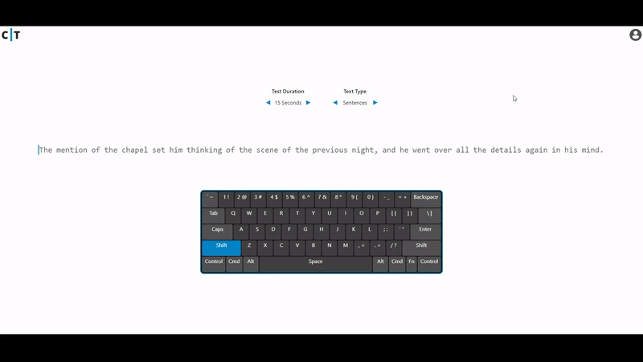

<p align="center">
    
    
</p>
<p align="center">
    <a href="https://www.customtypingpractice.com">🌐 Live Demo</a>
    |
    <a href="https://codesandbox.io/p/devbox/github/dmm22/typing-demo">🔳 CodeSandBox</a>
</p>

## Introduction

Welcome to my demo project! This repository highlights my front-end development skills, particularly with React. Created as part of my job search, it aims to demonstrate my capabilities to potential employers. While this demo includes selected functionality from a larger, unique project I'm working on, detailed descriptions of the main project will be provided later in the README.

## Features

- **Extensive Sentence Library:** Over 400 sentences sourced from 2000+ books, chosen based on the frequency of common words, phrases, and letters to create enjoyable typing practice.
- **Comprehensive Word List:** Includes 2000+ of the most frequent words from the books.
- **Customizable Tests:** Ability to change test duration and select different text types.
- **Interactive Keyboard Mockup:** Highlights keys as you type for better visual feedback.
- **Smooth Cursor Movement:** Provides responsive and fluid typing experience.
- **Dynamic Letter Highlighting:** Provides immediate feedback with color changes (red for incorrect, gray for complete).
- **Interactive Timer:** Tracks your progress in real-time.
- **Visual Performance Analysis:** Features line and scatter charts to visualize typing performance.
- **Profile Management:** Placeholder profile saves test results in local storage and summarizes statistics.
- **Global Test Reset:** Easily reset tests by pressing the tab key.

## Technologies Used


## Production Environment

In the main project, user authentication is handled using Auth0. Users sign in on the client, which sends a JWT to the server. The server then stores this JWT as a secure cookie, with Axios interceptors ensuring the cookie is sent with each request. The server verifies the JWT to grant access to protected routes.

Data storage is managed with an AWS RDS database, utilizing Prisma as the ORM. The project supports CRUD operations for creating new tests, saving stats, searching stats, searching tests, and updating stats. Database queries are validated using Zod schemas.

Server responses follow a consistent format, including success and data/error properties. An error handler middleware manages errors. The server architecture is modular, with separation into controllers, services, repositories, validation, and routes. The server is hosted on an EC2 instance and includes rate limiting for added security.

On the client side, React Query is used to manage server state, with most functionality similar to the demo project but persisted in the database. The client collects data on typing patterns, weaknesses, and commonalities. The Axios default URL is set to the API base URL.

API endpoints are structured as follows:

```
// app.ts
app.use("/api/text", textRouter);
app.use("/api/tests", testRouter);
app.use("/api/users", userRouter);
...

// routes/testRouter.ts
router.post("/", testController.createTest);
router.get("/", testController.readTests);
...

// routes/textRouter.ts
router.post("/", textController.getText);
router.get("/evaluation/:type/:qty", textController.getEvaluationText);
...

// routes/userRouter.ts
router.post("/", userController.createUser);
router.get("/:userId", userController.getUser);
...
```
